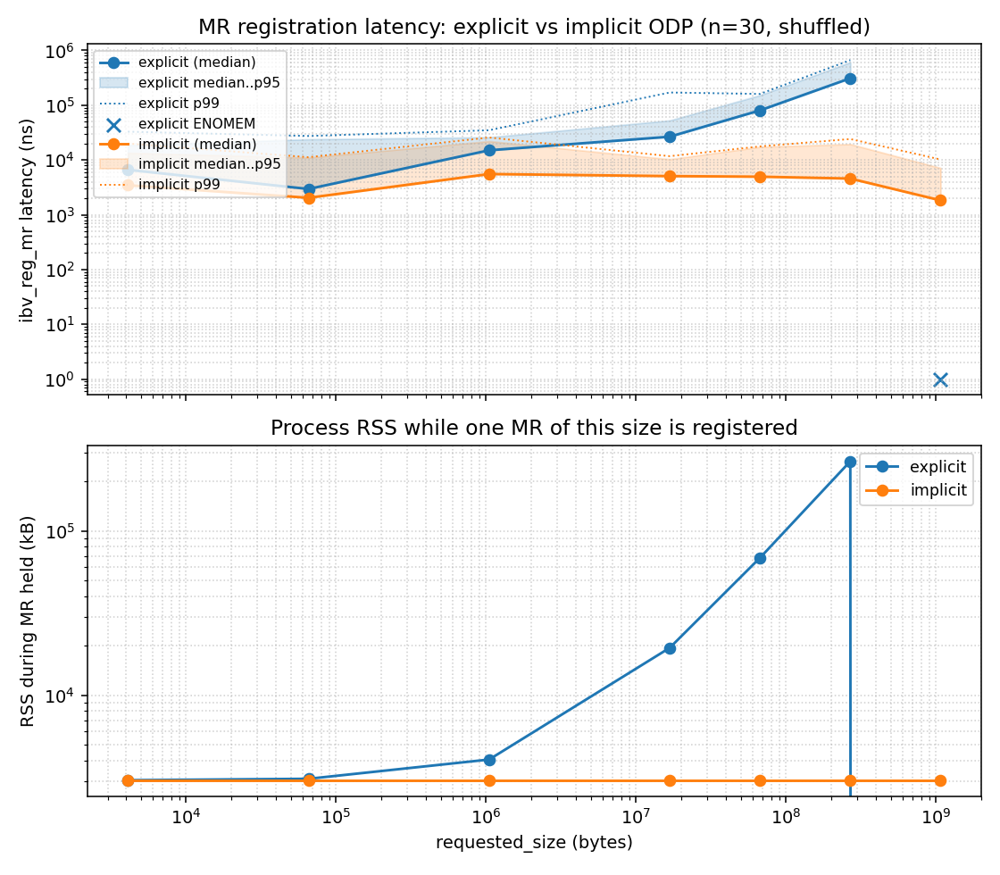

# RXE local-access implicit ODP

Prototype local-access implicit On-Demand Paging for Linux Soft-RoCE/RXE.

Implemented registration form:

```c
ibv_reg_mr(pd, NULL, SIZE_MAX,
           IBV_ACCESS_ON_DEMAND | IBV_ACCESS_LOCAL_WRITE);
```

The lkey is valid at the registration boundary and resolves pages on
first SGE access through 2 MiB child umems held in an xarray on the MR.
Remote implicit access is out of scope and is rejected with
`-EOPNOTSUPP`.

## Layout

- `patches/` kernel patch against `drivers/infiniband/sw/rxe/`
- `tests/` libibverbs validation programs
- `bench/` registration-latency benchmark
- `results/linux-6.17/` measured output and `NOTES.md` for the CSV schema
- `DESIGN.md` data structures and call paths
- `CLAIMS.md` exact scope of what is and is not implemented

## Result



Two panels, both on log-log axes.

- **Top: `ibv_reg_mr` latency.** Explicit median grows with region size.
  1 GiB explicit fails (`ENOMEM`, shown as an x). Implicit median stays
  in the low-microsecond band across every size bucket.
- **Bottom: peak process RSS while one MR is registered.** This is the
  underlying property the latency curve is measuring. Explicit RSS
  climbs with the registered size because each page is pinned. Implicit
  RSS stays flat at the baseline regardless of bucket label, because no
  pages are pinned at registration.

See `results/linux-6.17/NOTES.md` for the CSV schema and methodology
(`n=30`, shuffled, warmup, percentile rule). The 7.1-rc2 results live
in `results/linux-7.1-rc2/`; the 6.17 results in `results/linux-6.17/`
are the historical run from before rebasing.

## Kernel branch

Patched source: [Liibon/linux-rxe-odp:rxe-local-implicit-odp](https://github.com/Liibon/linux-rxe-odp/tree/rxe-local-implicit-odp)

Base: `rdma/for-next` at commit `7fd2df204f34` (Linux 7.1-rc2). The
slim fork's `main` branch carries a snapshot of
`drivers/infiniband/sw/rxe/` from that base for easy diffing.

## Reproduce

1. Build and boot the patched kernel from the branch above.
2. `sudo modprobe rdma_rxe`
3. `sudo rdma link add rxe0 type rxe netdev <eth>`
4. `make -C tests && make -C bench`
5. `RXE_DEV=rxe0 tests/implicit_odp_reg_test`
6. `RXE_DEV=rxe0 tests/implicit_odp_write_test`
7. `RXE_DEV=rxe0 tests/implicit_odp_multi_test`
8. `RXE_DEV=rxe0 tests/implicit_odp_cross_test`
9. `bench/run.sh` (or `bench/bench_reg_latency --seed 42 > out.csv`)

All tests and the bench accept `--dev rxe0` or `RXE_DEV=rxe0`.

## Known limitations and next work

The full scope boundary is in [CLAIMS.md](CLAIMS.md). The headline limits:

- **No eviction.** Child umems are created on first access and stay until
  MR destroy. Long-lived implicit MRs touching a sparse address space
  accumulate children. A reclaim mechanism is the natural next chunk.
- **No atomic / flush / atomic-write on implicit MRs.** Those helpers
  walk the parent umem directly and would need the same child-resolution
  wrapper used by the copy path. They return `-EOPNOTSUPP` /
  `RESPST_ERR_RKEY_VIOLATION` on implicit today.
- **No remote rkey on implicit MRs.** Remote-access bits are rejected at
  registration time. Exposing implicit-shaped MRs to peers needs its own
  threat-model discussion.
- **Not an upstream submission yet.** This is a prototype patch series.
  An RFC against `rdma/for-next` is the planned next step. See the patch
  cover material in `patches/`.
- **Registration-only bench.** The included benchmark intentionally
  measures registration-time work. ODP shifts cost to first-touch / fault
  paths; separate first-touch and steady-state benchmarks are needed to
  fully characterize the tradeoff.
