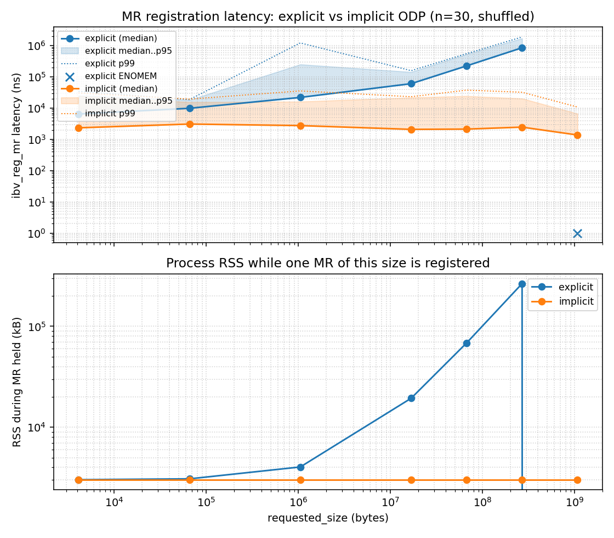

# RXE local-access implicit ODP

Prototype local-access implicit On-Demand Paging for Linux Soft-RoCE/RXE.

Implemented registration form:

```c
ibv_reg_mr(pd, NULL, SIZE_MAX,
           IBV_ACCESS_ON_DEMAND | IBV_ACCESS_LOCAL_WRITE);
```

The lkey is valid at the registration boundary and resolves pages on
first SGE access through 2 MiB child umems held in an xarray on the MR.
Remote implicit access is out of scope and is rejected with
`-EOPNOTSUPP`.

## Layout

- `patches/` kernel patch against `drivers/infiniband/sw/rxe/`
- `tests/` libibverbs validation programs
- `bench/` registration-latency benchmark
- `results/linux-6.17/` measured output and `NOTES.md` for the CSV schema
- `DESIGN.md` data structures and call paths
- `CLAIMS.md` exact scope of what is and is not implemented

## Result



Two panels, both on log-log axes.

- **Top: `ibv_reg_mr` latency.** Explicit median grows from ~6 us at 4 KiB
  to ~850 us at 256 MiB. 1 GiB explicit fails (`ENOMEM`, shown as an x).
  Implicit median sits in the 1-3 us band across every size bucket.
- **Bottom: peak process RSS while one MR is registered.** This is the
  underlying property the latency curve is measuring. Explicit RSS
  climbs from ~3 MB (baseline) to ~265 MB at 256 MiB because each
  registered page is pinned. Implicit RSS stays flat at the ~3 MB
  baseline regardless of bucket label, because no pages are pinned at
  registration.

See `results/linux-6.17/NOTES.md` for the exact CSV schema and
methodology (`n=30`, shuffled, warmup, percentile rule).

## Kernel branch

Patched source: [Liibon/linux-rxe-odp:rxe-local-implicit-odp](https://github.com/Liibon/linux-rxe-odp/tree/rxe-local-implicit-odp)

Base: `torvalds/linux` at tag `v6.17` (commit `e5f0a698b`).

## Reproduce

1. Build and boot the patched kernel from the branch above.
2. `sudo modprobe rdma_rxe`
3. `sudo rdma link add rxe0 type rxe netdev <eth>`
4. `make -C tests && make -C bench`
5. `tests/implicit_odp_reg_test`
6. `tests/implicit_odp_write_test`
7. `tests/implicit_odp_multi_test`
8. `bench/run.sh`
